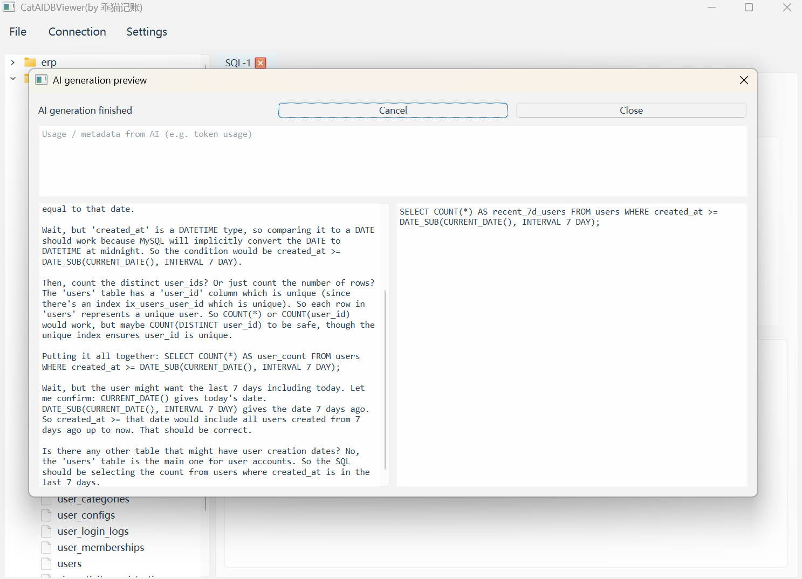
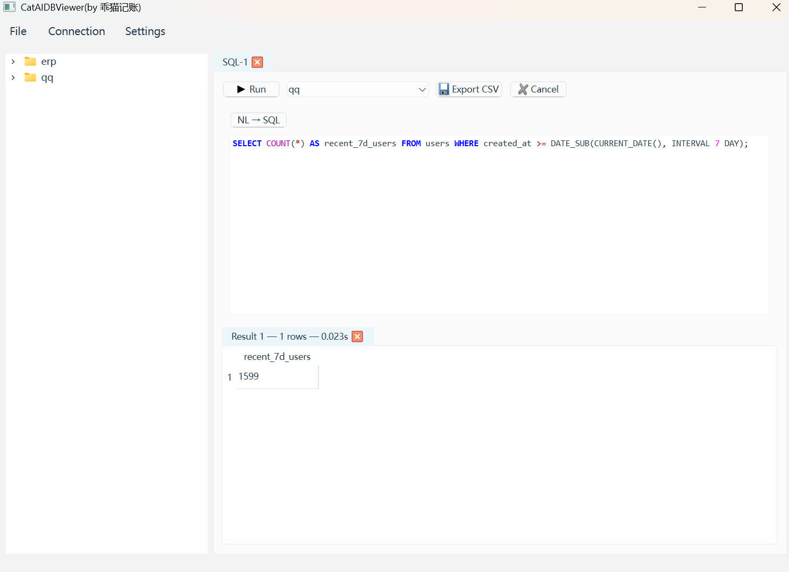
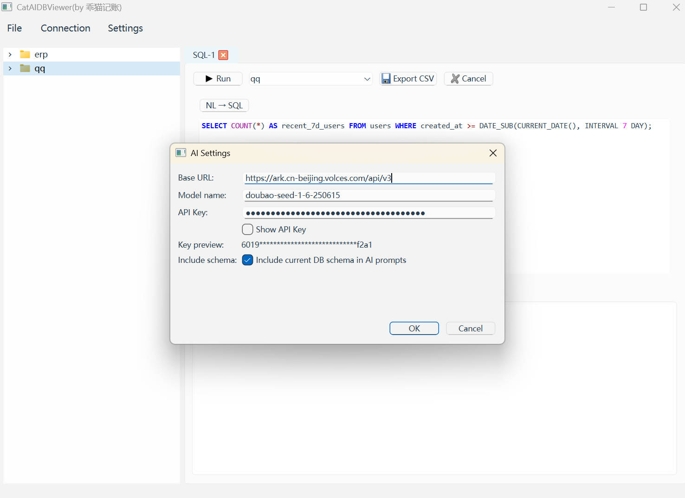

# CatAIDBViewer / CatAIDBViewer

 

A lightweight, developer-focused database client built with PyQt6 and SQLAlchemy.

CatAIDBViewer is a compact and reliable desktop tool designed for developers and DBAs to quickly connect to, explore, query, and export data from relational databases (SQLite, MySQL, PostgreSQL).

Table of Contents

- Features
- Screenshots
- Quick start
- Configuration & credentials
- Project layout
- Implementation notes
- Testing & CI
- Contributing
- License

核心目标（简要）

- 以可用性与稳定性为优先，提供常用数据库管理与查询功能。
- 清晰分离 UI 与数据库逻辑，便于扩展与测试。
- 支持多种数据库驱动与跨数据库的执行逻辑。

Key features

- Multiple connections: Manage and test connections for SQLite, MySQL, and PostgreSQL.
- SQL editor: Syntax highlighting, line numbers, basic autocomplete (table/column), run selection or entire script, multi-statement support.
- Result grid: Paginated loading, sorting, copy/paste, CSV export.
- Schema browser: View tables, columns, indexes, and CREATE statements.
- Transaction controls: Begin / Commit / Rollback with user-friendly error reporting.
- Safe in-grid edits: Pending edits tracked in UI and applied using SQLAlchemy Core for cross-dialect correctness.

Screenshots / 仓库截图

Below are a few screenshots from the repository demonstrating the main UI areas. Image files are located in the imgs/ directory at the repository root.

- Main window — connections, SQL editor and result grid

  

  主窗口：左侧连接列表，中央 SQL 编辑器，底部结果表格，适合快速执行与浏览查询结果。

- Schema viewer — tables and column details

  

  模式查看器：显示表、列、索引以及生成的 CREATE 语句，便于理解数据库结构。

- SQL editor — syntax highlighting and autocomplete

  

  SQL 编辑器：语法高亮、行号和基础自动补全（表/列），支持执行选中或全部脚本并查看多语句返回结果。

- Export / CSV — export result set to CSV

  

  导出示例：将结果集导出为 CSV（可配置分隔符与编码），便于与外部工具共享或分析。

Quick start

Prerequisites

- Python 3.10+
- A virtual environment is recommended

Create a virtual environment (Windows)

python -m venv .venv
.\.venv\Scripts\activate

Create a virtual environment (Linux / macOS)

python3 -m venv .venv
source .venv/bin/activate

Install dependencies

pip install -r requirements.txt

Install database drivers (examples)

- MySQL (PyMySQL): pip install PyMySQL
- PostgreSQL: pip install psycopg2-binary
- SQLite: included with Python

Run the app (from repo root)

python ./src/app.py

Quick usage

1) Add a connection via the connection dialog (File → New Connection). Test before saving.  
2) Open a SQL editor tab, write SQL and press Run to execute selection or the whole script.  
3) Browse results in the grid — copy/paste, sort columns, or export to CSV.

Configuration & credentials

Connection configurations are saved under an OS-appropriate directory by default:

- Windows: %APPDATA%\CatAIDBViewer\config.json
- macOS/Linux: ~/.catdbviewer/config.json

Sensitive fields (passwords) are not stored in plaintext by default — the app supports optional encryption or leaving credentials to the system keyring. Check src/utils/settings.py for the persistence logic.

Project layout

- src/
  - app.py — application entry point
  - main_window.py — main UI orchestration
  - db/ — database abstraction (connection manager, executor, metadata exploration)
  - editor/ — SQL editor and syntax highlighter
  - models/ — QAbstractTableModel result model
  - ui/ — dialogs and widgets (schema viewer, connection dialog, AI settings)
  - utils/ — helpers (CSV export, worker threads, settings)
  - tests/ — unit tests

Implementation notes & recommendations

- SQL execution and metadata introspection are implemented in src/db. Long-running operations run on worker threads to avoid blocking the UI.
- For safety across dialects, UPDATE and DELETE operations generated from UI edits use SQLAlchemy Core to avoid dialect-specific quoting and paramstyle issues.
- Table name extraction from arbitrary SQL is heuristic (sqlparse) and may not work for complex queries — UI allows manual selection of a writable target table when needed.

Testing & CI

- Unit tests are under src/tests and focus on the database abstraction, SQL execution, and export utilities.
- Run tests locally with pytest:

pytest -q

- Recommended CI: GitHub Actions matrix job for Windows and Ubuntu that runs pytest and optionally builds PyInstaller artifacts for releases.

Contributing

- Follow PEP8 and type annotate where practical.  
- Run formatting (black) before committing.  
- Include tests for changes to core logic and database abstractions.

License

This project is released under the MIT License — see LICENSE for details.

Contact

For issues and feature requests, please open an issue on the repository.

——

中文简介

CatAIDBViewer 是一款基于 PyQt6 与 SQLAlchemy 的轻量级数据库客户端，面向开发者与数据库管理员，旨在提供可靠、易用的数据库浏览与查询体验，适配 SQLite、MySQL 与 PostgreSQL。