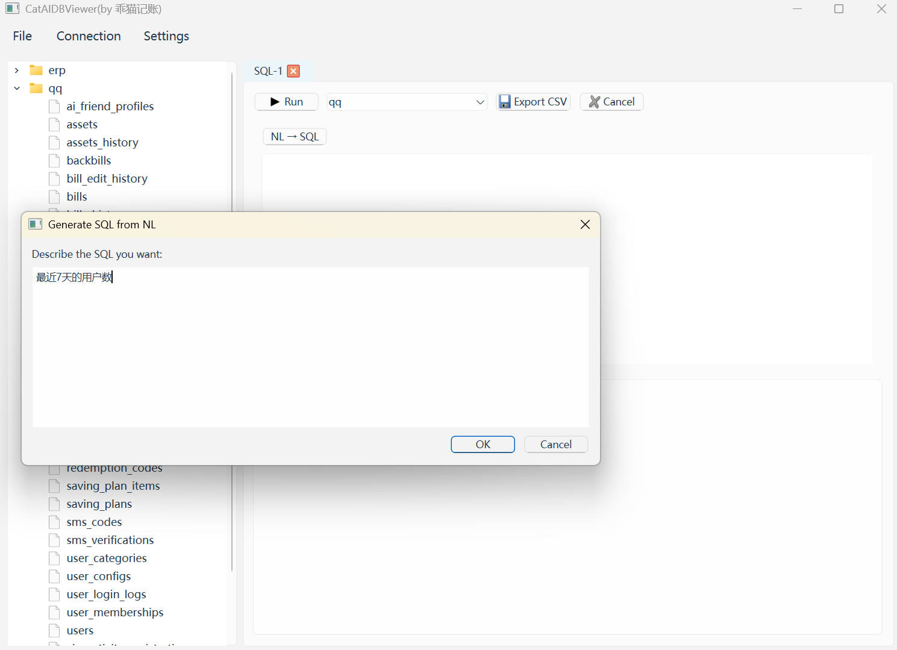
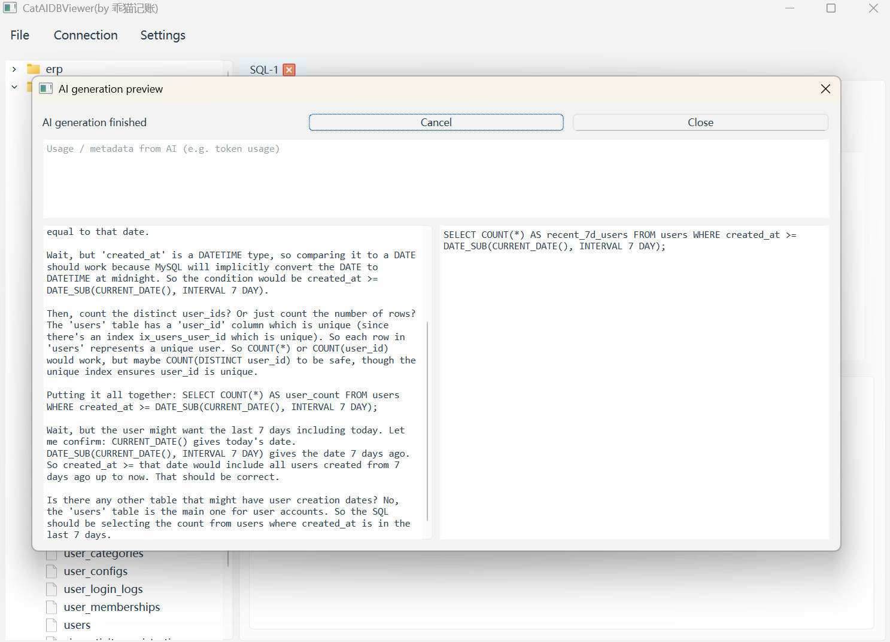
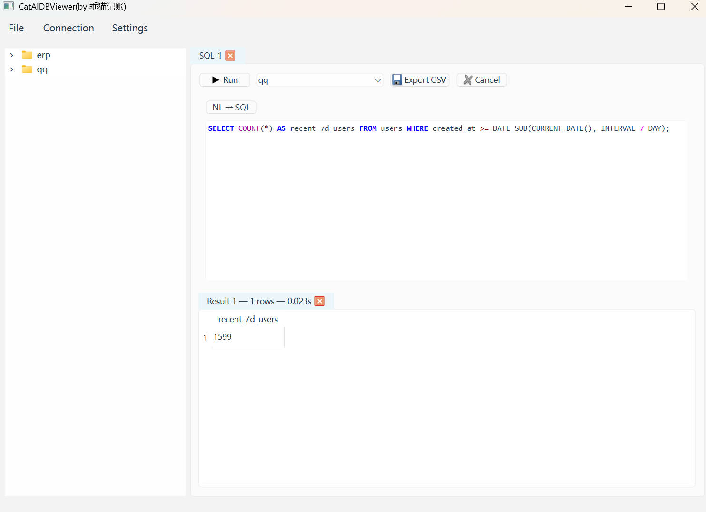
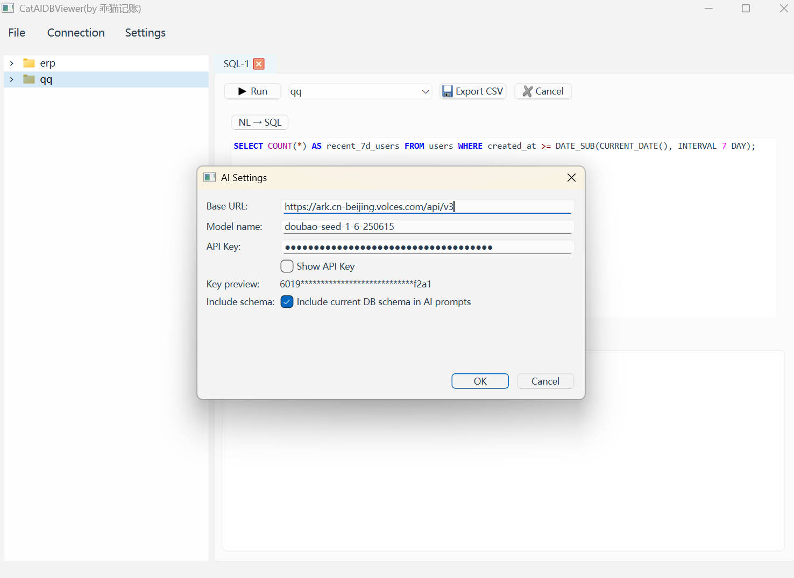

# CatAIDBViewer / CatAIDBViewer

 

一款基于 PyQt6 与 SQLAlchemy 的轻量级数据库客户端，面向开发者与数据库管理员。支持快速连接、浏览、查询与导出关系型数据库数据（SQLite、MySQL、PostgreSQL）。

目录

- 功能亮点
- 仓库截图
- 快速上手
- 配置与凭据
- 项目结构
- 实现说明
- 测试与 CI
- 贡献
- 许可

功能亮点

- 多连接管理：支持管理 SQLite、MySQL、PostgreSQL 连接并测试连接。
- SQL 编辑器：语法高亮、行号、基础自动补全（表/列）、执行选中或整段 SQL、支持多语句执行。
- 结果表格：分页加载、排序、复制/粘贴、导出 CSV。
- 模式查看：查看表、列、索引以及 CREATE 语句。
- 事务控制：开始 / 提交 / 回滚，并提供友好错误提示。
- 安全的表内编辑：在 UI 中跟踪待提交的更改，并使用 SQLAlchemy Core 应用以保证跨方言的正确性。

仓库截图

下列为仓库中的界面截图，图片位于 imgs/ 目录下：

- 主窗口 — 连接、SQL 编辑器与结果表格

  

  主窗口：左侧为连接列表，中央为 SQL 编辑器，底部为结果表格，适合快速执行与查看查询结果。

- 模式查看器 — 表与列详情

  

  模式查看器：显示数据库对象、列信息、索引及生成的 CREATE 语句，帮助理解数据结构。

- SQL 编辑器 — 语法高亮与自动补全

  

  编辑器支持语法高亮、行号及基础的表/列自动补全，支持执行选中 SQL 或整个脚本。

- 导出 / CSV — 将结果导出为 CSV

  

  导出示例：将结果集导出为 CSV（可配置分隔符与编码），便于与其他工具共享或分析。

快速上手

前提

- Python 3.10+
- 建议使用虚拟环境

Windows 创建虚拟环境

python -m venv .venv
.\.venv\Scripts\activate

Linux / macOS 创建虚拟环境

python3 -m venv .venv
source .venv/bin/activate

安装依赖

pip install -r requirements.txt

数据库驱动示例

- MySQL (PyMySQL): pip install PyMySQL
- PostgreSQL: pip install psycopg2-binary
- SQLite: 随 Python 自带

运行应用（在仓库根目录）

python ./src/app.py

快速使用指南

1) 通过连接对话框添加连接（文件 → 新建连接），保存前请先测试连接。  
2) 打开 SQL 编辑器，输入 SQL，点击运行执行所选或全部脚本。  
3) 在结果表格中浏览结果 — 复制/粘贴、排序或导出 CSV。

配置与凭据

默认连接配置保存在操作系统适配的目录：

- Windows: %APPDATA%\CatAIDBViewer\config.json
- macOS/Linux: ~/.catdbviewer/config.json

敏感信息（如密码）默认不会以明文保存——程序支持可选加密或使用系统 keyring 存储。详见 src/utils/settings.py 的实现。

项目结构

- src/
  - app.py — 应用入口
  - main_window.py — 主窗口与 UI 组装
  - db/ — 数据库抽象层（连接管理、执行器、元数据探查）
  - editor/ — SQL 编辑器与高亮/补全实现
  - models/ — QAbstractTableModel 结果模型
  - ui/ — 对话框与自定义控件（模式查看、连接对话框等）
  - utils/ — 工具函数（CSV 导出、工作线程、配置）
  - tests/ — 单元测试

实现说明

- SQL 执行与元数据探查在 src/db 中实现，耗时操作在工作线程中运行以避免阻塞 UI。  
- UI 生成的 UPDATE/DELETE 操作通过 SQLAlchemy Core 构造以保证跨方言的兼容性与安全性。  
- 从自由 SQL 中提取表名使用启发式方法（例如 sqlparse），复杂查询可能无法准确推断，UI 支持手动选择目标表。

测试与 CI

- 单元测试位于 src/tests，重点覆盖数据库抽象层、执行器与导出工具。  
- 本地运行测试：

pytest -q

- 推荐在 GitHub Actions 中使用 Windows 与 Ubuntu 的矩阵作业运行 pytest，并在发布时可选构建 PyInstaller 可执行文件。

贡献

- 遵循 PEP8，尽量添加类型注解。  
- 提交前运行 black 格式化。  
- 对核心逻辑的变更请补充相应单元测试。

许可

本项目使用 MIT 许可 —— 详见仓库根目录的 LICENSE 文件。

联系

如需反馈问题或功能建议，请在仓库中提交 issue。